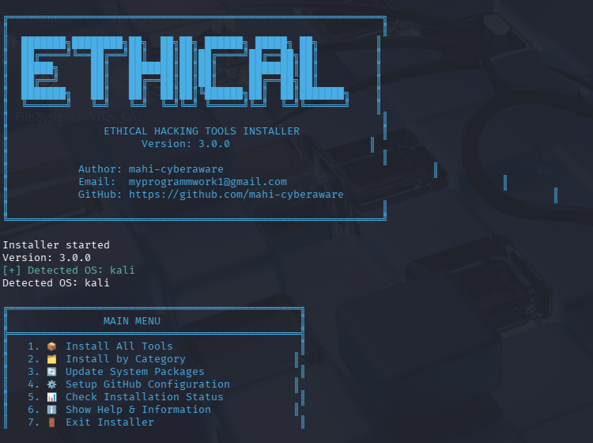

# 🔧 Ethical Hacking Tools Installer


## 🎥 Demo
 

One-command installer for ethical hacking tools on Kali Linux, Termux (Android), and iSH (iOS).

# Clone and run in one command:
git clone https://github.com/mahi-cyberaware/ethical-hacking-tools-installer.git && cd ethical-hacking-installer && ./setup.sh && ./ethical_hacking_installer.sh


## 🚀 Features

- **Multi-Platform Support**: Works on Kali Linux, Termux, and iSH
- **300+ Tools**: Pre-configured tool lists
- **Easy to Use**: Simple menu-driven interface
- **Auto-Detection**: Automatically detects your OS
- **Safe Installation**: Only from official repositories
- **GitHub Ready**: Pre-configured with your credentials

## 📦 Installation
## 📱 Platform-Specific Installation

### Termux (Android):
```bash
# Install Termux from Play Store, then:

pkg update && pkg upgrade
pkg install git
git clone https://github.com/mahi-cyberaware/ethical-hacking-tools-installer.git
cd ethical-hacking-tools-installer
chmod +x setup.sh ethical_hacking_installer.sh
./setup.sh
./ethical_hacking_installer.sh

# Install iSH from App Store, then:

apk update && apk upgrade
apk add git bash
git clone https://github.com/mahi-cyberaware/ethical-hacking-tools-installer.git
cd ethical-hacking-tools-installer
chmod +x setup.sh ethical_hacking_installer.sh
./setup.sh
./ethical_hacking_installer.sh

# Note: iSH has limited package availability

git clone https://github.com/mahi-cyberaware/ethical-hacking-tools-installer.git
cd ethical-hacking-tools-installer
chmod +x setup.sh ethical_hacking_installer.sh
./setup.sh
./ethical_hacking_installer.sh


