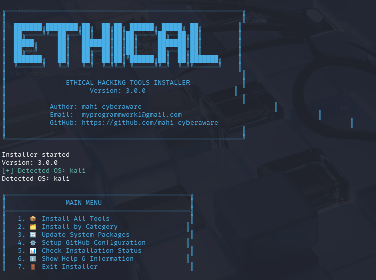

# 🔧 Ethical Hacking Tools Installer

Cross-platform installer for ethical hacking and cybersecurity tools
designed for educational environments, security research, and
authorized penetration testing workflows.

Supports:
- Kali Linux
- Termux
- iSH
- Linux-based environments


## 🎥 Demo
 

One-command installer for ethical hacking tools on Kali Linux, Termux (Android), and iSH (iOS).

# Clone and run in one command:
git clone https://github.com/mahi-cyberaware/ethical-hacking-tools-installer.git && cd ethical-hacking-installer && ./setup.sh && ./ethical_hacking_installer.sh


## 🚀 Features

- **Multi-Platform Support**: Works on Kali Linux, Termux, and iSH
- **300+ Tools**: Pre-configured tool lists
- **Easy to Use**: Simple menu-driven interface
- **Auto-Detection**: Automatically detects your OS
- **Safe Installation**: Only from official repositories
- **GitHub Ready**: Pre-configured with your credentials

## 📦 Installation
## 📱 Platform-Specific Installation

### 🐉 Kali Linux

```bash
sudo apt update && sudo apt upgrade -y

sudo apt install git -y

git clone https://github.com/mahi-cyberaware/ethical-hacking-tools-installer.git

cd ethical-hacking-tools-installer

chmod +x setup.sh ethical_hacking_installer.sh

./setup.sh

./ethical_hacking_installer.sh
```

---

### 📱 Termux (Android)

```bash
pkg update && pkg upgrade -y

pkg install git -y

git clone https://github.com/mahi-cyberaware/ethical-hacking-tools-installer.git

cd ethical-hacking-tools-installer

chmod +x setup.sh ethical_hacking_installer.sh

./setup.sh

./ethical_hacking_installer.sh
```

---

### 🍎 iSH (iOS CLI)

```bash
apk update && apk upgrade

apk add git bash

git clone https://github.com/mahi-cyberaware/ethical-hacking-tools-installer.git

cd ethical-hacking-tools-installer

chmod +x setup.sh ethical_hacking_installer.sh

./setup.sh

./ethical_hacking_installer.sh
```

> ⚠️ Note:
> iSH uses Alpine Linux and some tools may have limited compatibility.

---

### 🐧 Linux Desktop (Ubuntu/Debian)

```bash
sudo apt update && sudo apt upgrade -y

sudo apt install git -y

git clone https://github.com/mahi-cyberaware/ethical-hacking-tools-installer.git

cd ethical-hacking-tools-installer

chmod +x setup.sh ethical_hacking_installer.sh

./setup.sh

./ethical_hacking_installer.sh
```

